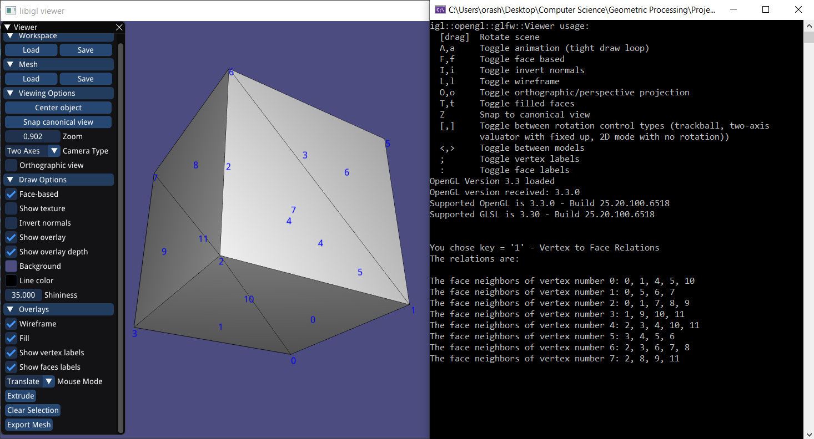
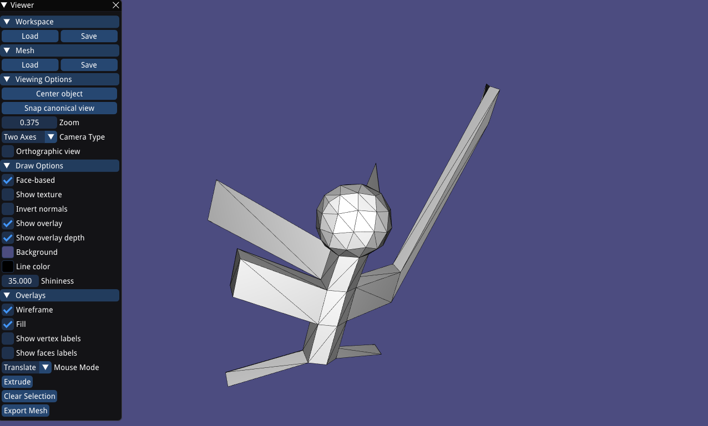

# ASSIGNMENT 1 - RESULTS

### Exercise 1: Vertex-to-Face Relations

## Exercise 2: Vertex-to-Vertex Relations

## Exercise 3: Connected Components

Some impressive connected components of our new 2021 Honda

## Exercise 4:  sqrt(3) Subdivision

I have decided to show how's the subdivision is done over a simple model, such as the  Cube model to show the correctness of the subdivision. 

Original Cube Model:

1 - Subdivision

2- Subdivision

3 - Subdivisions

## Exercise 5: Extrusion

1) First I show here that the extrude function actually works. Therefore I represent here two images of the cube before and after the extrusion.

Before:

After: 

#### The Artistic Part

The story tells about a ping-pong headed transformer, who changed his shape from a cube into a ping-pong winged robot hero by some subdivisions and extrusion. The Winged Ping-Pongbot saved Haifa's civilians from notorious criminals.

Here are some images of The Winged Ping-Pongbot in action:

The little secret that The Winged Ping-Pongbot has hidden from everyone is that he actually has malicious intensions! HE WANTS TO ENSLAVE EVERYONE SO THE ROBOTS WILL TAKE OVER HAIFA!

The Winged Ping-Pongbot subdivided himself (transformed himself by few subdivisions),  and showed his real face, as the son of T-1000: T-10000

The father:

The son (T-10000):

 

 

(**NOTE: This the design.off model in the data folder**)

All of the sudden came up a new hero who Haifa's people weren't even aware of his existence: **CUBEUOS PRIME!**

Cubeuos Prime found out about the T-10000 evil intensions and came right away to stop him before the takeover embarks.

 

(Cubeuos Prime)

After a terrific fight between the two (A fight scene from the Michael Bay's type - lots of explosions), Cubeuos Prime came with his hand on top and saved Haifa from the takeover, and beat T-10000 (who was The winged ping pongbot) 

THE END

thanks for watching :)
