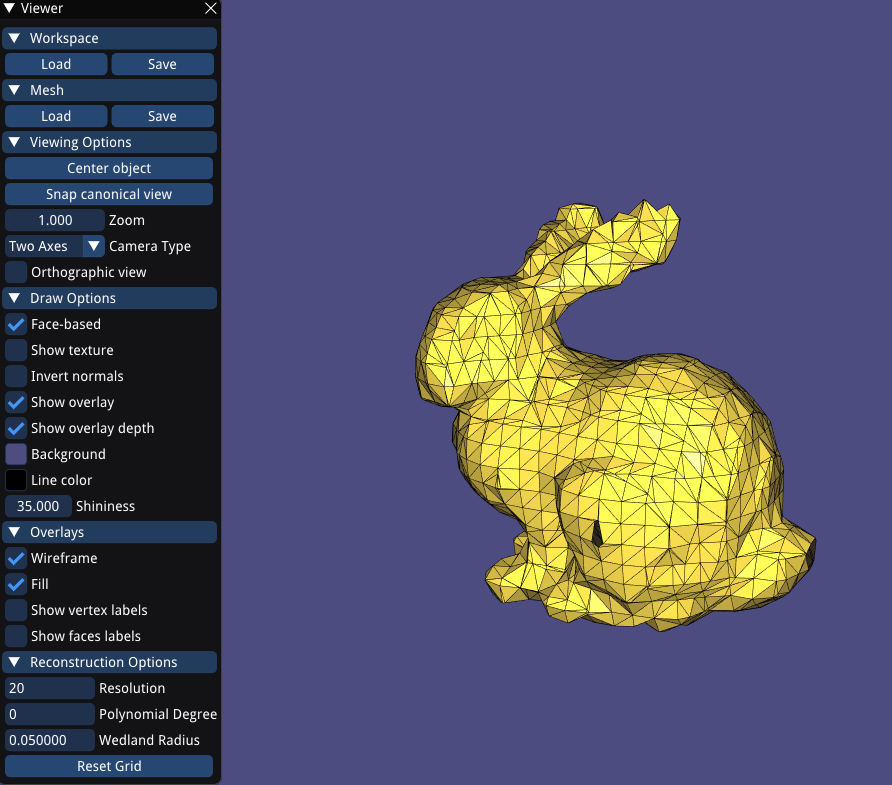
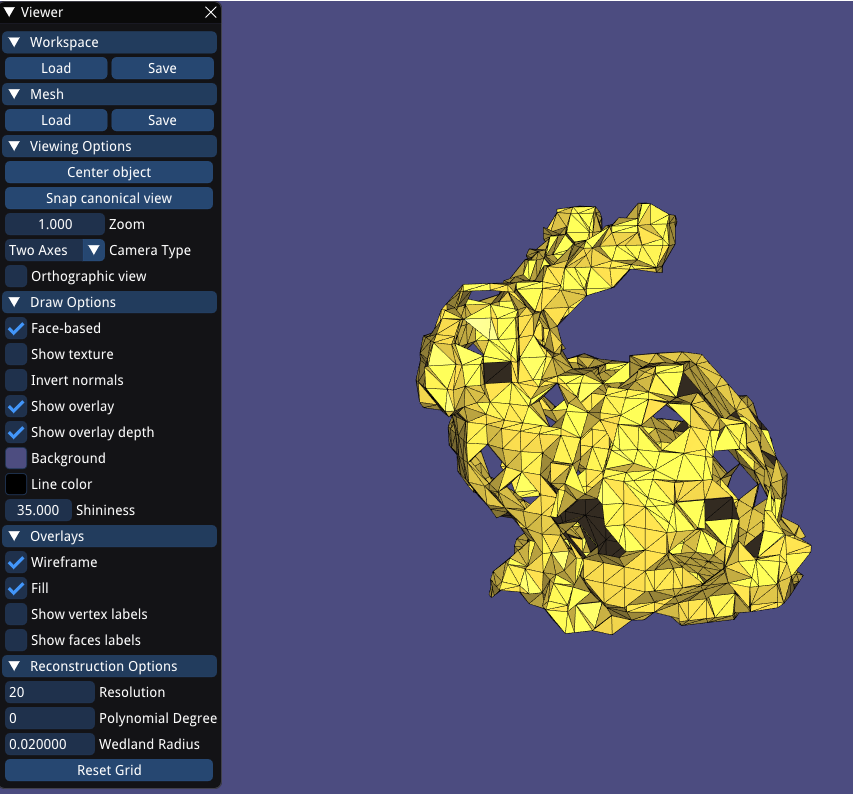

# Assignment 2

## Required results: Mandatory Tasks

1) Show the visualization of the constrained points for the 'cat.off' point cloud.

cat.off point cloud:

2) Show screenshots of the grid with nodes colored according to their implicit function values (cat.off and luigi.off).

cat.off grid:

luigi.off grid:

3) 

We can see the changing parameters  at the bottom-left corner of each image.

Few things I observed while the program reconstructed several surfaces  with different parameters are:

a. The more we increase the resolution value, the grid becomes more dense but has much more computing complexity.

b. When the Wedland Radius is bigger than 0.1, the model becomes more rounded and barely recognize what kind of a model it is.  When the Wedland Radius is less than 0.1, we can see that the model is starting to have holes in it, which forces the resolution value to increase in order to minimize the holes in the model.

Anisotropic in 3 axis:

All reconstructed models (that my GPU could handle) are in the data folder under the prefix "reconstruced"

4) Theory question: 

