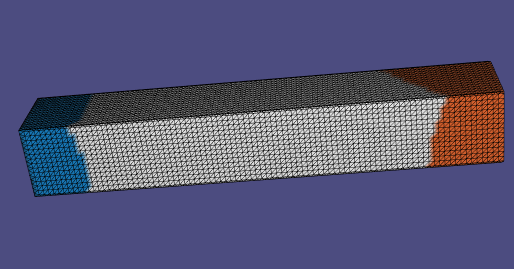

# Assignment 4

## Required results for assignment 4

| Model Name  |                              S                               |                              B                               |                              B'                              |                              S'                              |
| ----------- | :----------------------------------------------------------: | :----------------------------------------------------------: | :----------------------------------------------------------: | :----------------------------------------------------------: |
| bumpy plane |  |  |  |  |
| woody-hi    |  |  |  |  |
| cylinder    |  |  |  |  |
| bar         |  |  |  |  |

