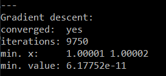
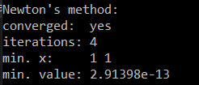
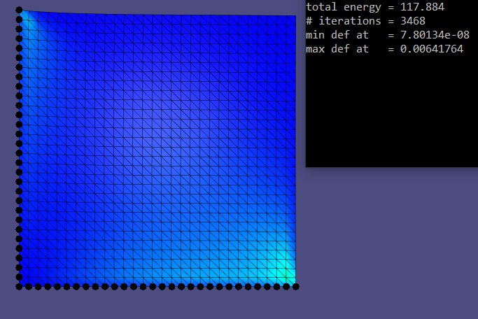
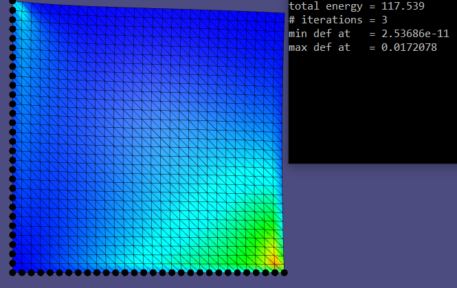

# Assignment 5

Edit this 'README.md' file to report all your results. There is no need to write lengthy reports, just show the requested outputs and screenshots and quickly summarize your observations.   

## Required results

### 1.1

### 1.2

### 2.1

### 2.2

### Summary

As we can see in both cases (Spring & Rosenbrock), the  Gradient Descent finds minimal value after a high number of iterations, while the Newton's methods gives an improved result and converge faster than the Gradient Descent method with significantly low number of iterations.

The results are getting with the expectations as the Newton's method should bring better results than the Gradient Descent method because the Newton's method is a second order optimization method, and the Gradient Descent method is a first order optimization method.